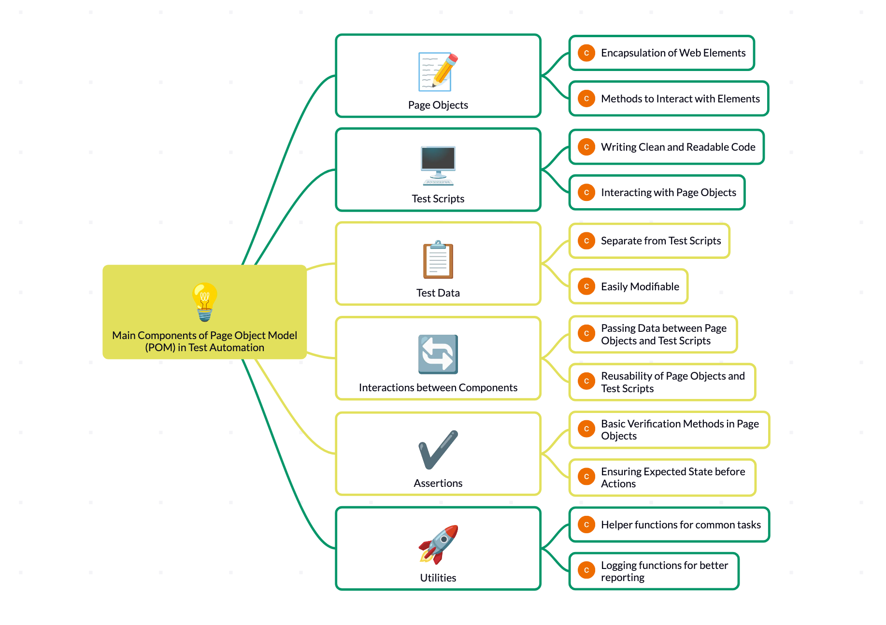

# POM Simplified 

## Page Class - UI Elements(Locators) / Methods
The page class is the core component of the POM. It represents a specific page or a section of the application's user interface. The main responsibilities of a page class are:

#### Locators: 
The page class contains locators that identify the web elements on the page, such as buttons, input fields, links, etc. These locators are typically defined using strategies like ID, name, class name, CSS selectors, or XPath.
    
#### Methods: 
The page class provides methods that encapsulate the actions that can be performed on the page. These methods use the locators to interact with the web elements, such as clicking buttons, entering text, selecting options, or verifying the presence of elements.

## Test Cases - Logic / Steps to execute
The test cases are where the actual logic and steps for testing a specific functionality are defined. The main responsibilities of test cases are:

Instantiation: Test cases create instances of the relevant page classes to interact with the application's pages.

Calling Methods: Test cases call the methods defined in the page classes to perform actions on the page, such as navigating to a specific page, entering data, clicking buttons, or verifying the expected behavior.

Assertions: Test cases contain assertions to verify the expected outcomes of the tested functionality. These assertions check if the application behaves as expected based on the user actions performed.

Test Setup and Teardown: Test cases handle the setup and teardown of the test environment, such as launching the browser, navigating to the application, and closing the browser after the test is completed.

#### The separation of concerns between page classes and test cases is a key aspect of the POM. Page classes focus on encapsulating the interactions with the UI, while test cases focus on defining the test logic and steps. 

This separation makes the code more modular, maintainable, and reusable. By using the POM, you can create test cases that are independent of the application's UI structure. If the UI changes, only the corresponding page class needs to be updated, while the test cases remain largely unaffected, reducing the maintenance effort.

## Abstract Classes in POM

### Definition:
 
An abstract class is a class that cannot be instantiated on its own and is meant to be subclassed. It can contain abstract methods (which have no implementation) and concrete methods (which do have implementation). In POM, abstract classes can be used to define common behaviors and properties for page objects or test classes.

### Purpose:

#### Code Reusability: 
Abstract classes allow you to define common functionality that can be shared across multiple page objects or test classes. This reduces code duplication and enhances maintainability.

#### Encapsulation of Common Logic: 
You can encapsulate common methods, such as driver initialization or common element interactions, in an abstract class. Concrete subclasses can then inherit this functionality.

#### Implementation:
In a typical POM setup, you might have an abstract base page class that defines common methods and properties for all page objects. For example:

    
    class BasePage:
        def __init__(self, driver):
            self.driver = driver

        def navigate_to(self, url):
            self.driver.get(url)

        def find_element(self, locator):
            return self.driver.find_element(*locator)

Then, specific page classes can inherit from this base class:

    class LoginPage(BasePage):
        def __init__(self, driver):
            super().__init__(driver)
            self.username_field = (By.ID, "username")
            self.password_field = (By.ID, "password")
            self.login_button = (By.ID, "login")

        def enter_username(self, username):
            self.find_element(self.username_field).send_keys(username)

        def enter_password(self, password):
            self.find_element(self.password_field).send_keys(password)
    
        def click_login(self):
            self.find_element(self.login_button).click()
            

## Abstract Test Classes

### Definition:
Similar to page objects, you can also create abstract test classes that define common test setup, teardown, and utility methods for your test cases.

### Purpose:
#### Common Test Logic: 
Abstract test classes can include setup methods (like initializing the browser) and utility methods that are applicable to multiple test cases.

#### Inheritance for Specific Tests: 
Specific test classes can inherit from the abstract test class, allowing them to reuse the setup and utility methods.
    
### Implementation:
Here’s an example of an abstract test class:

    class BaseTest:
        @pytest.fixture(scope="class", autouse=True)
        def setup(self):
            self.driver = webdriver.Chrome()
            yield
            self.driver.quit()

Specific test classes can then inherit from this base test class:

    class TestLogin(BaseTest):
        def test_valid_login(self):
            login_page = LoginPage(self.driver)
            login_page.enter_username("valid_user")
            login_page.enter_password("valid_password")
            login_page.click_login()
            assert "Dashboard" in self.driver.title

## Conclusion
Using abstract classes in the Page Object Model allows for better organization, code reuse, and maintainability. Abstract page classes can encapsulate common functionality for page interactions, while abstract test classes can streamline the setup and execution of tests. This design pattern helps to create a cleaner and more efficient test automation framework.
